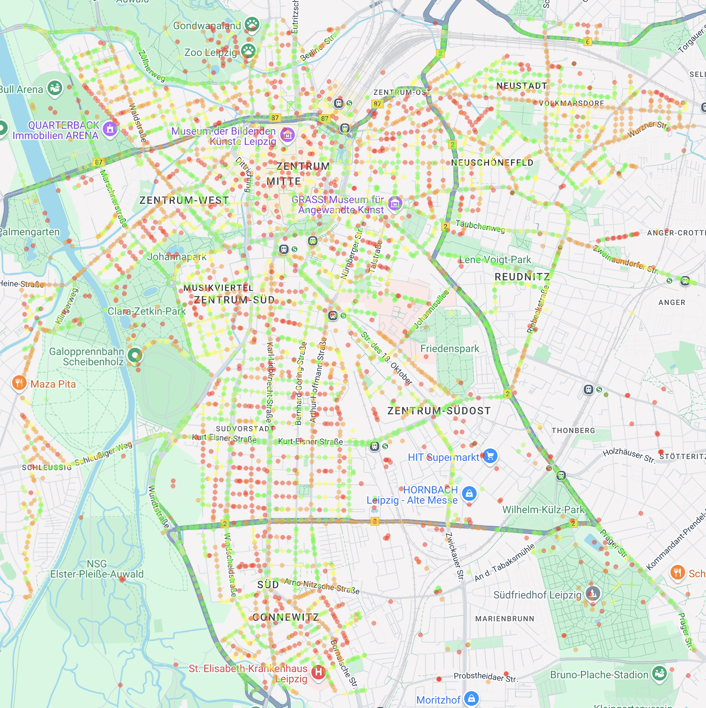

# road-quality-classification

This repository offers a complete pipeline to **automatically assess road quality using Google Street View images**. From fetching the images to advanced deep learning classification.

## Key Features

* **Image Extraction:** Programmatically pulls Google Street View images for any specified geographic area.
* **Smart Filtering:** Filters out non-street images (e.g., sky, ground) with an interactive UI for precise control.
* **Deep Learning Classification:** Trains a **ResNet50 CNN** to classify road quality, using custom loss and metrics (`BalancedHybridLoss`, `BalancedLabelDistance`) to handle ordinal data and class imbalance effectively.
* **Map Visualization:** Generates an **interactive HTML map** with colored markers to visually represent classified road quality data, making spatial analysis intuitive.
* **Comprehensive Evaluation:** Provides detailed accuracy and label distance metrics, including per-class performance.

---

## How It Works

The process is divided into three main stages, followed by visualization:

1.  **Image Extraction:** Downloads unique Street View panoramas, creating a grid of coordinates for a defined area.
2.  **Image Categorization (Filtering):** Uses a Streamlit app to interactively filter out irrelevant images based on visual properties like saturation and brightness.
3.  **Road Quality Classification:** Trains a deep learning model on the filtered images to classify road quality. Custom functions ensure robust training even with imbalanced datasets.
4.  **Map Visualization:** After classification, a Python script generates an HTML map, overlaying colored circles at image locations to show predicted road quality, offering a clear spatial overview.

## Getting Started

### Configuration

Create a `.env` file in the root of your project directory and add the following:

```bash
GCP_API_KEY="YOUR_GOOGLE_CLOUD_API_KEY"
GCP_SIGNING_SECRET="YOUR_GOOGLE_CLOUD_SIGNING_SECRET"

NORTH_WEST="LATITUDE_NW,LONGITUDE_NW"
SOUTH_EAST="LATITUDE_SE,LONGITUDE_SE"
```

Replace placeholders with your actual Google Cloud credentials and desired geographical bounding box coordinates.
The `NORTH_WEST` and `SOUTH_EAST` variables define the bounding box for the area from which you want to extract street view images.

### [Optional] Download Dataset

If you want to use our pre-existing dataset for training and evaluation, you can download it from [here.](https://drive.google.com/file/d/1x3EScOoQ9fMtsAY1nGyI0p9BcaqriR1J/view?usp=sharing)

This dataset is based on the work of [lenoch0d.](https://github.com/lenoch0d/road-quality-classification)


---

## Usage Guide

This guide outlines the steps to extract, categorize, classify, and visualize road quality data using the provided scripts.

### 1. Run Image Extraction

This step downloads street view images to a specified output directory.

```bash
python ./src/fetch/extract_street_view_images.py
```

Images will be saved in the `images/all_images` directory.

### 2. Run Image Preselection

```bash

streamlit run ./src/filter/filter_unwanted_images_saturation.py
```

Open your browser to the URL displayed in your terminal.
Adjust parameters within the Streamlit app to review and filter images.
The "good" (filtered) images will be saved in `images/good_images/`.

### 3. Train Road Quality Classifier

This step trains a ResNet50 model using a pre-existing dataset.

 This project utilizes an extended dataset from the [road-quality-classification](https://github.com/lenoch0d/road-quality-classification) repository.
You will have to rework the structure of the dataset. Add a `dataset` folder to `images`. Put the trainings and validation datasets into this directoriy. Rename them to `train` and `val`. Also the class directories in the dataset should be renamed from 0 to 5 instead of 1 to 6.

```bash
python train_classifier.py
```

The best-performing model will be saved as `road_quality_classifier.pkl`.
Training progress will be logged in `training_log.csv`.

### 4. Run Road Quality Classification

If you have set up the project structure according to this README you only have to change the path to the model you want to use.
```bash
python src/model/rate_pictures.py
```
Images will be categorized and saved into subfolders (0 to 5) within the `images/sorted_by_class` directory, corresponding to their predicted road quality class.

### 5. Generate Map Visualization

After classifying the images, run this script to create an interactive HTML map.

```bash
python src/map/generate_map_from_images.py
```

Open the generated `map.html` file in your web browser.
An interactive HTML map visualizing the classified road quality data.

## Example Results
